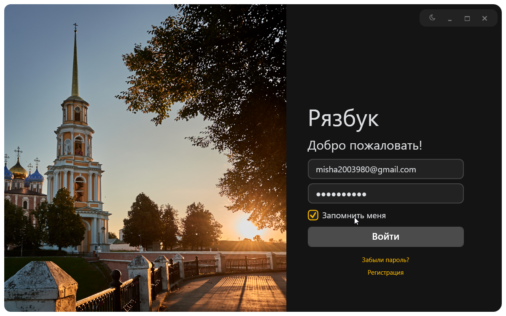
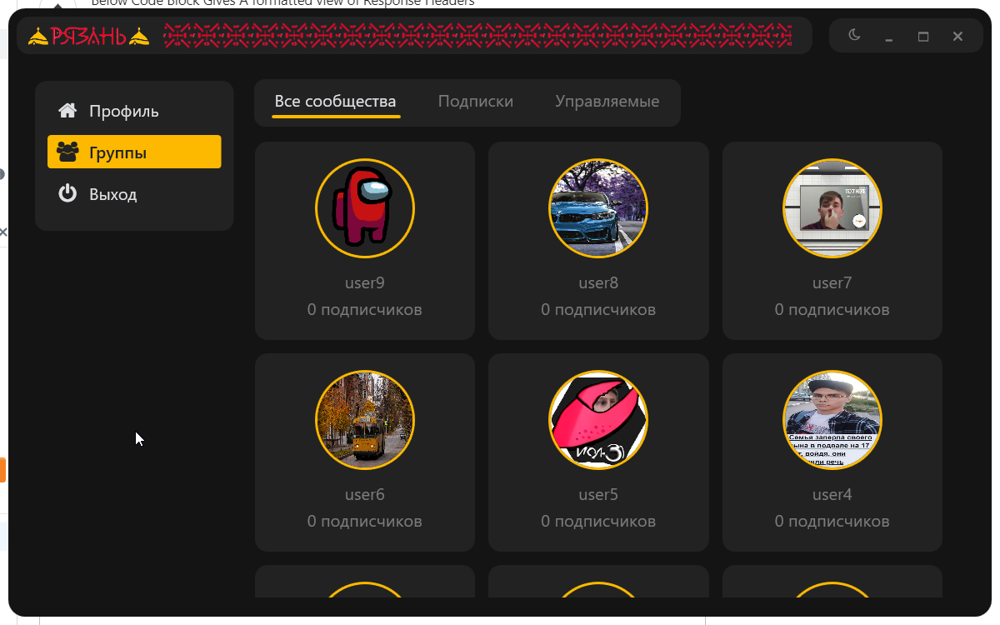
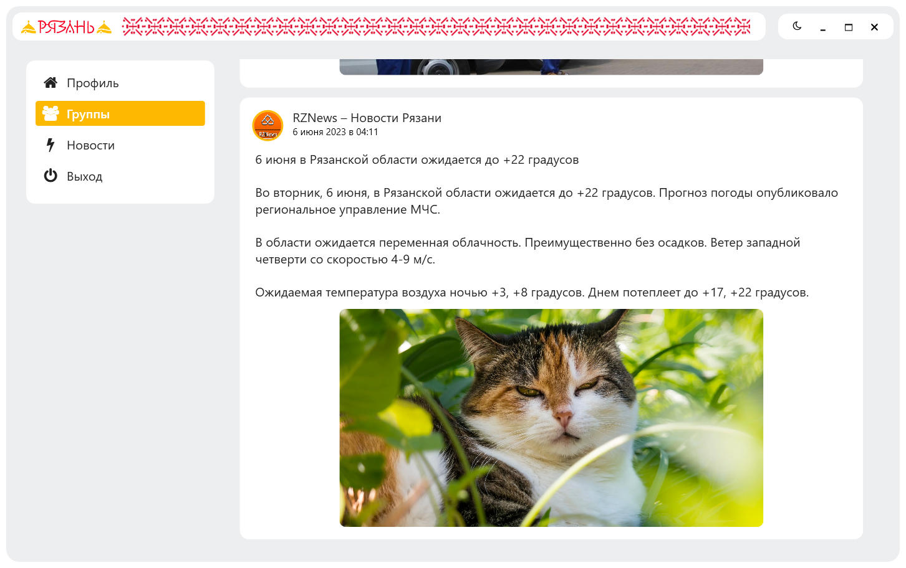

# RyazanSpace
Дипломный проект - Соцсеть для Рязани. 
Распределенная система на .Net Core 6
## Основные фишки:
- Аутентификация пользователя (авторизация, регистрация, сброс пароля, подтверждения почты);
- Создание и редактирование профиля;
- Создание и редактирование групп;
- Подписка на группы;
- Новостная лента
## Схема системы:
</img>
## Немного скриншотов:
<table >
<tr>
<td></img></td>
<td></img></td>
</tr>
<tr>
<td></img></td>
<td></img></td>
</tr>
</table>
